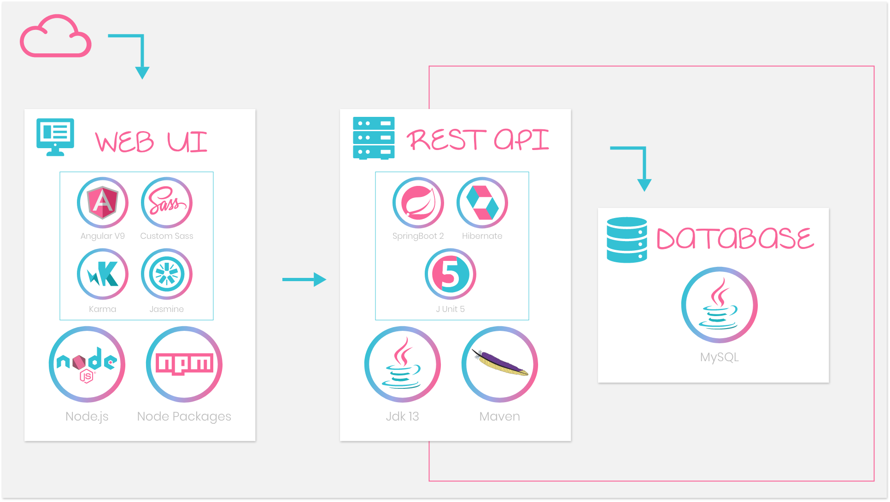

# e.Tin Application Overview

## 

## Getting Started 💪

> These instructions will get you a copy of the project up and running on your local machine for development and testing purposes.
> Each folder hold a README for further information

## Prerequisites 📚

| Dependency | version required |
|:-----------|:----------:|
| Maven | 3.6.0 |
| JDK | 13.0.1 |
| Node.js | 10.16.0 |
| Angular CLI | 9.1.0 |
| SQL Workbench | 8.0.19 |

> Additional information related to each part of the project can be found in the nested REAME.md files. Here is only a handy overview of the application.

## 

## Contact ✉️

Feel free to [Submit new issue](https://github.com/louiiuol/swear-tin/issues) if you have any suggestions or wish to learn more about certain aspects of this project.
