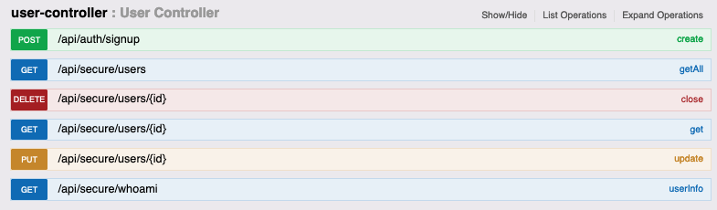
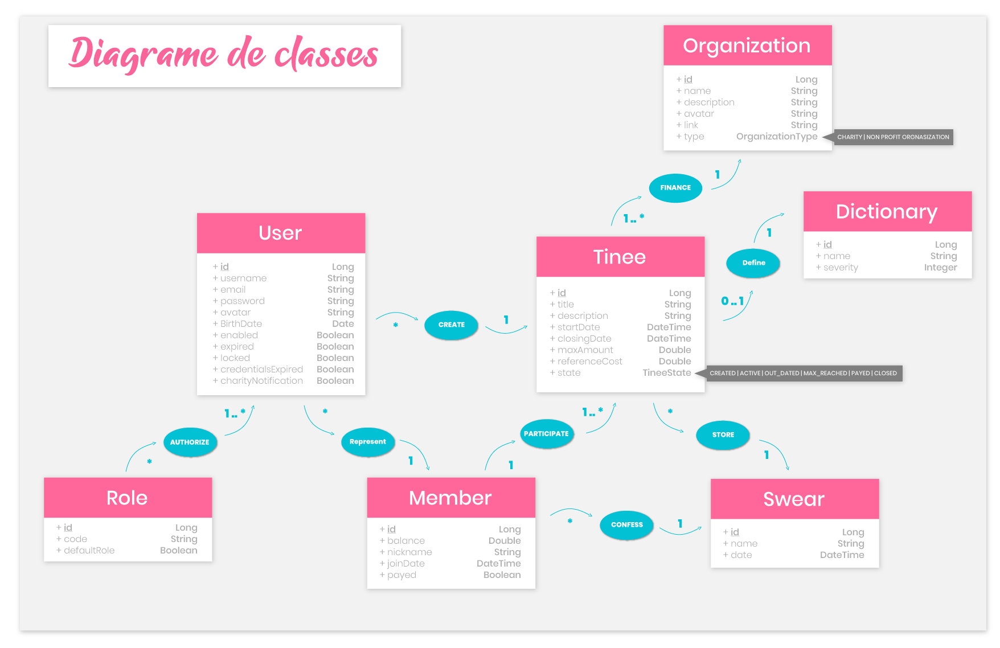

# Jar it Api V1

## 

> This application, using SpringBoot Security combined with OAuth, provides a secured RESTFUL API to handle, persist and retrieve business values, mapped from *dtos* to *entities*, in the database configured as requested. More information about the API context and technical stack available in the documentation.

## Getting Started 💪

> These instructions will get you a copy of the project up and running on your local machine for development and testing purposes.
> Each folder hold a README for further information

## Prerequisites 📚

| Dependency | version required |
|:-----------|:----------:|
| Maven | 3.6.0 |
| JDK | 13.0.1 |
| SQL Workbench | 8.0.13 |

## Installing 🛠

```shell
cd {YOUR_WORKSPACE}/jar-it/application/api;
mvn clean install;
mvn spring-boot:run -Dspring-boot.run.profiles=[dev/prod/test]
```

## Testing & Build 🧪

>Tests are very time consuming and no always worthy. Because this application is mainly a RESTFUL API, tests will be focused around Integration Test. More details about the tests in the documentation.

```shell
cd {YOUR_WORKSPACE}/jar-it/application/api;
mvn clean install
```

> This will generate a .jar file that can be executed on any OS with a JDK 13 installed.

## Deployment 🚀

```shell
java -jar -Dspring.profiles.active=[dev/prod/test] {YOUR_WORKSPACE}/jar-it/application/api/target/jar-it-server.jar
```

## REST API Resources

> This program provides a RESTFUL API to handle functionalities needed to build IHM. Please follow the guide if you want to do your own request. Find below all resources available:

### Users

## 

## Models

> FInd below most relevant models of the API

## 

***

## Contact ✉️

Feel free to [Submit new issue](https://github.com/louiiuol/jar-it/issues) if you have any suggestions or wish to learn more about certain aspects of this project.
