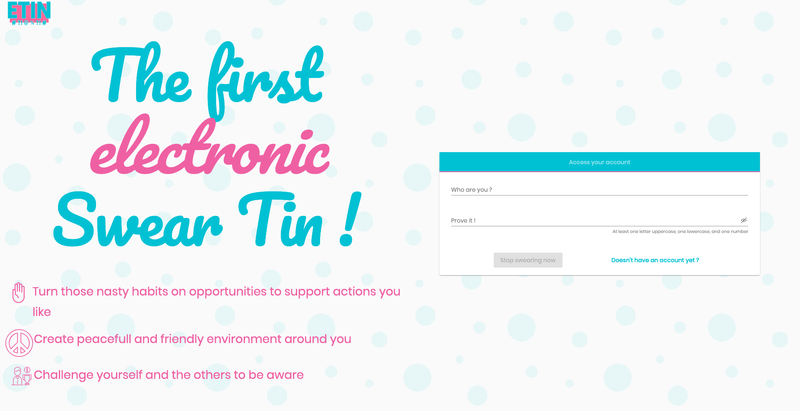

# e-Tin Web UI

## 

## Prerequisites 📚

| Dependency | version required |
|:-----------|:----------:|
| Node.js | 10.16.0 |
| Angular CLI | 9.1.0 |

## Built With 🚀

| Dependency | version |
|:-----------|:----------:|
| Angular animations | ~9.1.0 |
| @angular/cdk | ^9.2.1 |
| @angular/material | ^9.2.1 |
| @angular/platform-browser-dynamic | ~9.1.0 |
| router | ~9.1.0 |
| ng2-cookies | ^1.0.12 |
| rxjs | ~6.5.4|
| karma | ^5.0.2 |
| @types/jasmine | ~3.5.0 |
| tslint | ~6.1.0 |
| typescript | ~3.8.3 |

## 

## Development server 🛠

> Run `ng serve` for a dev server. Navigate to `http://localhost:3333/`. The app will automatically reload if you change any of the source files.

```shell
cd {YOUR_WORKSPACE}/swear-tin/application/web-ui;
npm install;
ng serve
```

## Testing🧪

> Run `ng test` to execute the unit tests via [Karma](https://karma-runner.github.io).
> Run `ng e2e` to execute the end-to-end tests via [Protractor](http://www.protractortest.org/).

## Build 🏗

> Run `ng build` to build the project. The build artifacts will be stored in the `dist/` directory. Use the `--prod` flag for a production build.

## Further help ☝️

To get more help on the Angular CLI use `ng help` or go check out the [Angular CLI README](https://github.com/angular/angular-cli/blob/master/README.md).

***

## Contact ✉️

Feel free to [Submit new issue](https://github.com/louiiuol/swear-tin/issues) if you have any suggestions or wish to learn more about certain aspects of this project.
