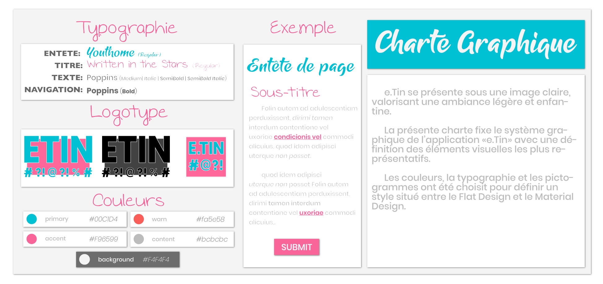
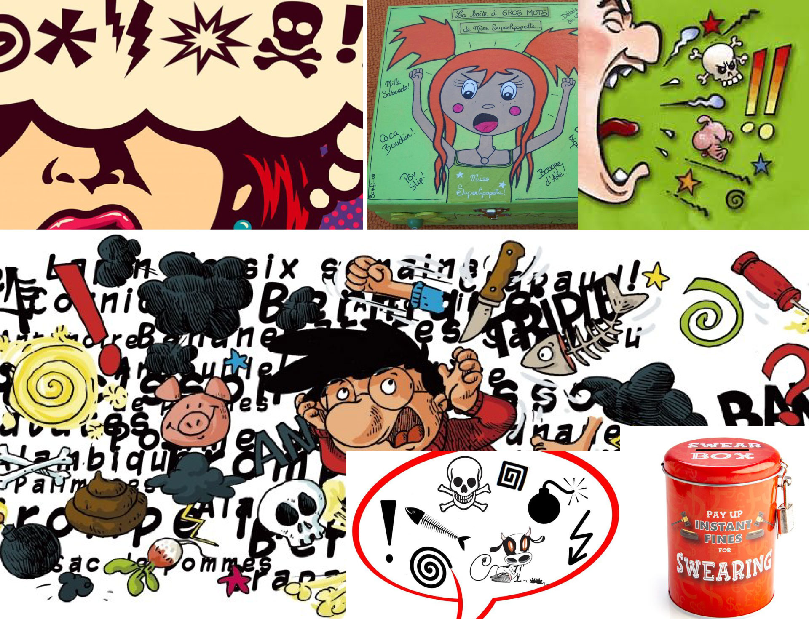

# *e*Tin | Graphical Chart 🎨

## 

## Overview

> The following chart defines the graphical sytem of «e.Tin» application with a concret definition of most important visual elements.

### 

## Mood board

> the following mood board helps graphist describing the atmosphere of the graphical chart: It provides the sources of inspirations used to choose colors, fonts, spacing and alignement.
>
> It describes a *cartoon atmosphere* with large fonts  and vives colors. This means that eTin needs to express more simple visual based on the *comics world*.

### 

## Colors

| Color      |                               Display                                  |   Hexa  |      RGB      |
|------------|:------------------------------------------------------------------:|:-------:|:-------------:|
| Primary    |  | #00c1d4 | (118,196,213) |
| Secondary  |  | #ef60a3 | (217,81,161) |
| Warning |  | #f9423a | (214,43,46) |
| Content |  | #bcbcbc | (188,188,188) |
| Background |  | #f4f4f4 | (244,244,244) |

## Fonts

> * **Headline**: YouthHome *(Regular)*
> * **SubTitle**: Written in the stars *(Regular)*
> * **Texts**: Poppins *(Medium / Medium Italic / SemiBold / SemiBold Italic)*
> * **Helpers**: Ubuntu sans *(Regular)*

## Logotype

> Le logotype est  l’élément le plus important de cette charte graphique. Il rappel le style Flat Design, par ses formes, mais est composé de vives couleurs.

### 

***

## Contact ✉️

Feel free to [Submit new issue](https://github.com/louiiuol/swear-tin/issues) if you have any suggestions or wish to learn more about certain aspect of this project.

🏡 *[Go back home](https://louiiuol.github.io/swear-tin/)*
