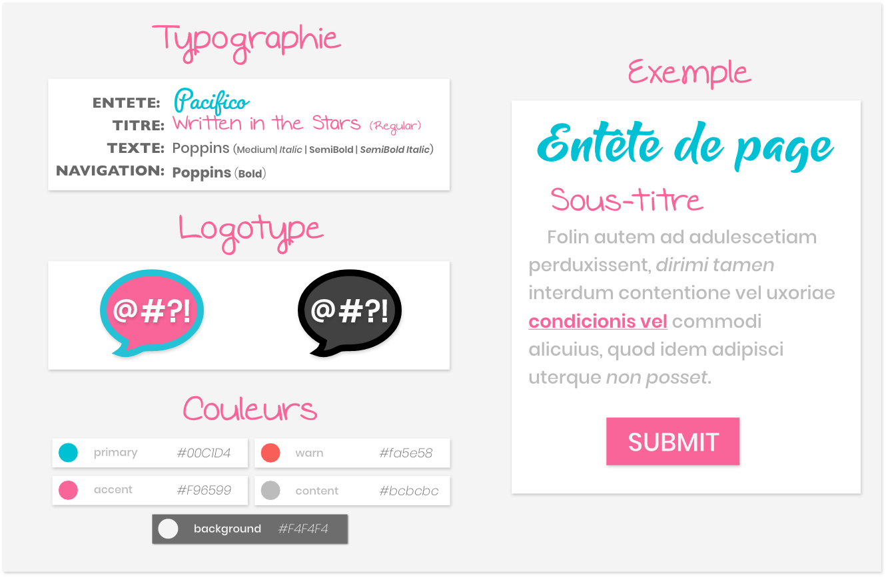

# Graphical Chart 🎨

## 

## Overview 🌍

The following chart defines the graphical visual looks of the « Jar it » application with a concrete definition of the most important visual elements.

### 

## Mood board 🖼

This mood board helps graphist describing the atmosphere of the graphical chart: It provides the sources of inspirations used to choose colors, fonts, spacing, and alignment.

> It describes a *cartoon atmosphere* with large fonts and vives colors. This means that eTin needs to express simpler visual based on the *comics world*.

### 

## Colors

| Color     |  Display     |   Hexa  |      RGB      |
|------------|:-----------:|:-------:|:--------:|
| Primary    |  | #00c1d4 | (118,196,213) |
| Secondary  |  | #ef60a3 | (217,81,161) |
| Warning |  | #f9423a | (214,43,46) |
| Content |  | #bcbcbc | (188,188,188) |
| Background |  | #f4f4f4 | (244,244,244) |

## Fonts

* **Headline**: Pacifico *(Regular)*
* **Texts**: Poppins *(Medium / Medium Italic / SemiBold / SemiBold Italic)*
* **Helpers**: Poppins *(Bold)*

## Logotype

Le logotype est l’élément le plus important de cette charte graphique. Il rappel le style Flat Design, par ses formes, mais est composé de vives couleurs.

### 

***

## Contact ✉️

Feel free to [Submit new issue](https://github.com/louiiuol/jar-it/issues) if you have any suggestions or wish to learn more about certain aspects of this project.

🏡 *[Go back home](../README.md)*
