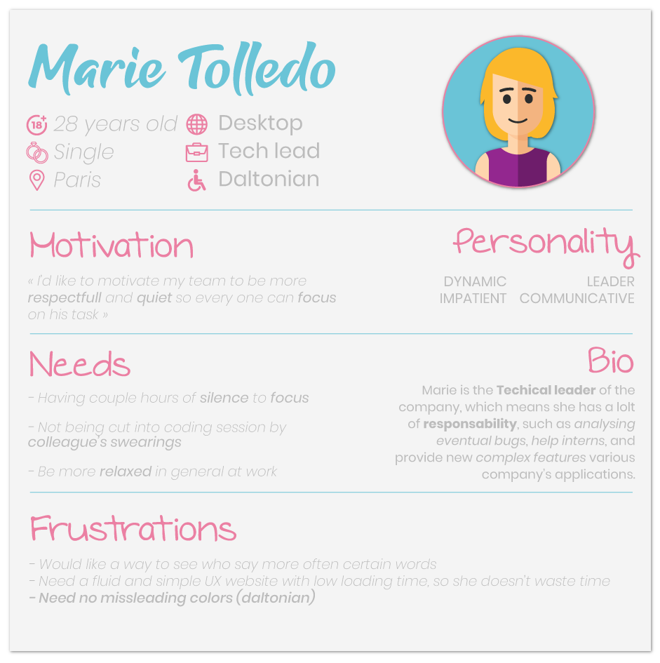
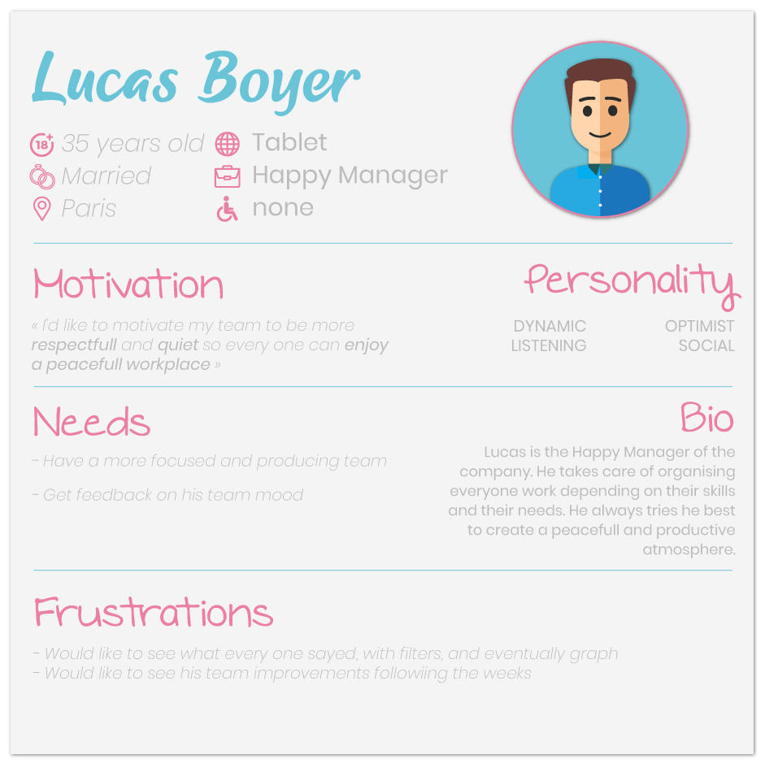
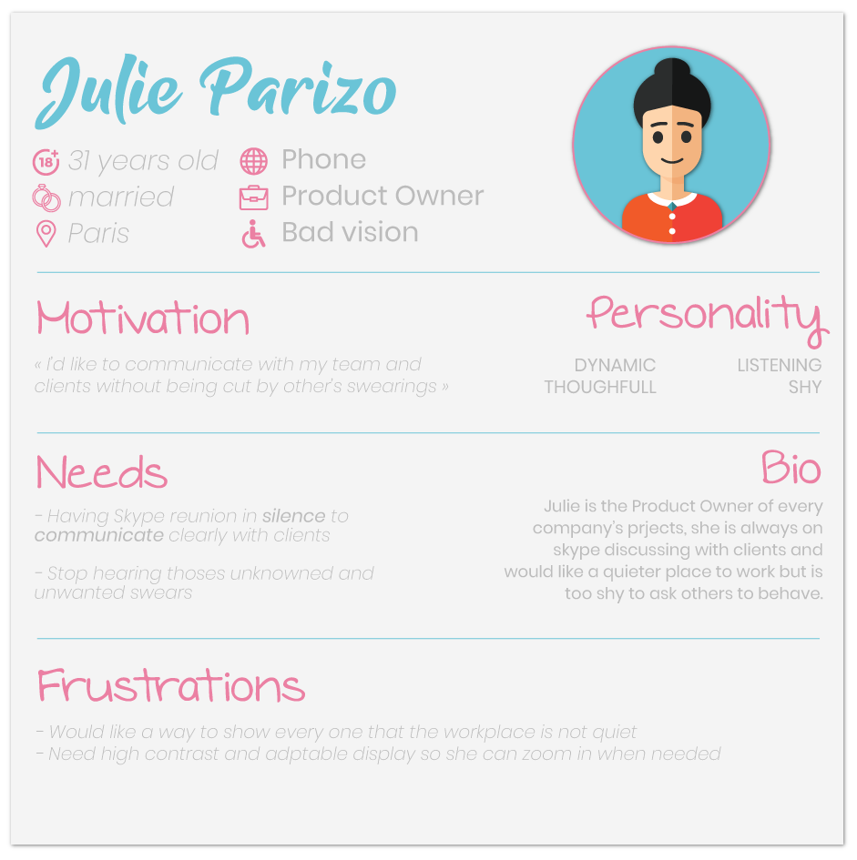
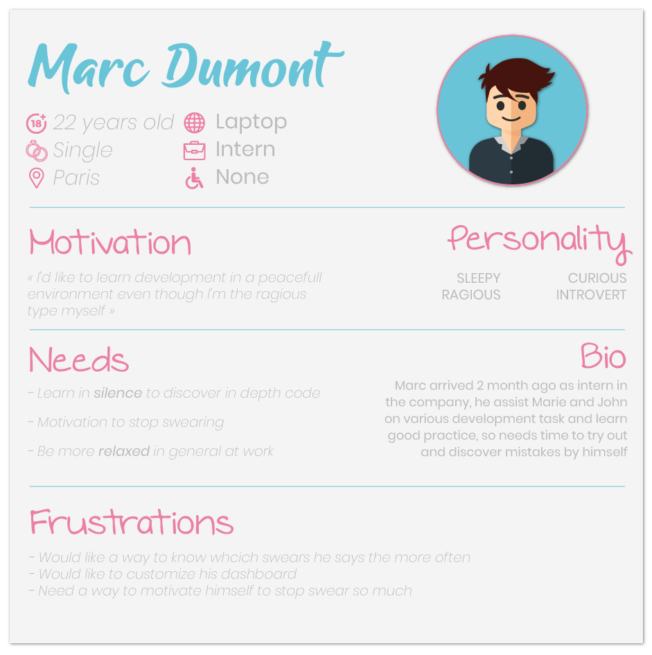

# Personae 🎭

## 

The following personae are used in the project, from the conception of UX designs, to creating new User Stories presenting a feature to answer a specific need.
In each case, personae will help to put themselves in the other final user's shoes, in order to:

* Answer the need of the target as close as we can be.
* Determine better UX and UI experience based on the user's personality and disabilities
* Anticipate eventual needs based on frustrations

## Targets 👥

* The application has no pre-define target because anyone could be interested to improve their group's mood.
Still, we can define 3 main contexts where this application will be in use: **Family, friends, and colleagues**.

## Overview 🌍

_For now, we'll only focus on the third context:_ **colleagues**.

The following personae defines final users of the application. Every feature, and mockup were made with the help of those personae: 4 people work in a Software development Startup. They spend the majority of time together and have no way to isolated themself.

| Name | Role | Device
|:-----------|:----------:|----------:|
| Marie | Tech' Leader |Desktop |
| Lucas | Happy Manager | Tablet |
| Julie | Product Owner | Phone |
| Marc | Intern | Laptop |

## Details 🔍

### Marie, _as_ **Tech' Leader**

Marie, as a Technological leader, is very busy. She often does some long Peer Review of code, where she need to be very focus and cannot be distracted by anything. She also helps a lot her team, and need calm to do so effectively.

#### 

### Lucas, _as_ **Happy Manager**

Lucas is the Happy Manager of the company. He takes care of coaching everyone's work depending on their skills and their needs. He always tries he best to create a peaceful and productive atmosphere.

#### 

### Julie, _as_ **Product Owner**

Julie is the Product Owner of every company’s projects, she is always on skype discussing with clients and would like a quieter place to work but is too shy to ask others to behave.  

#### 

### Marc, _as_ **Intern**

Marc arrived 2 months ago as an intern in the company, he assist Marie and John on various development task and learn the good practices, so needs time to try out and discover mistakes by himself

#### 

## Conclusion 💡

To conclude ...

***

## Contact ✉️

Feel free to [Submit new issue](https://github.com/louiiuol/jar-it/issues) if you have any suggestions or wish to learn more about certain aspects of this project.

🏡 *[Go back home](../README.md)*
