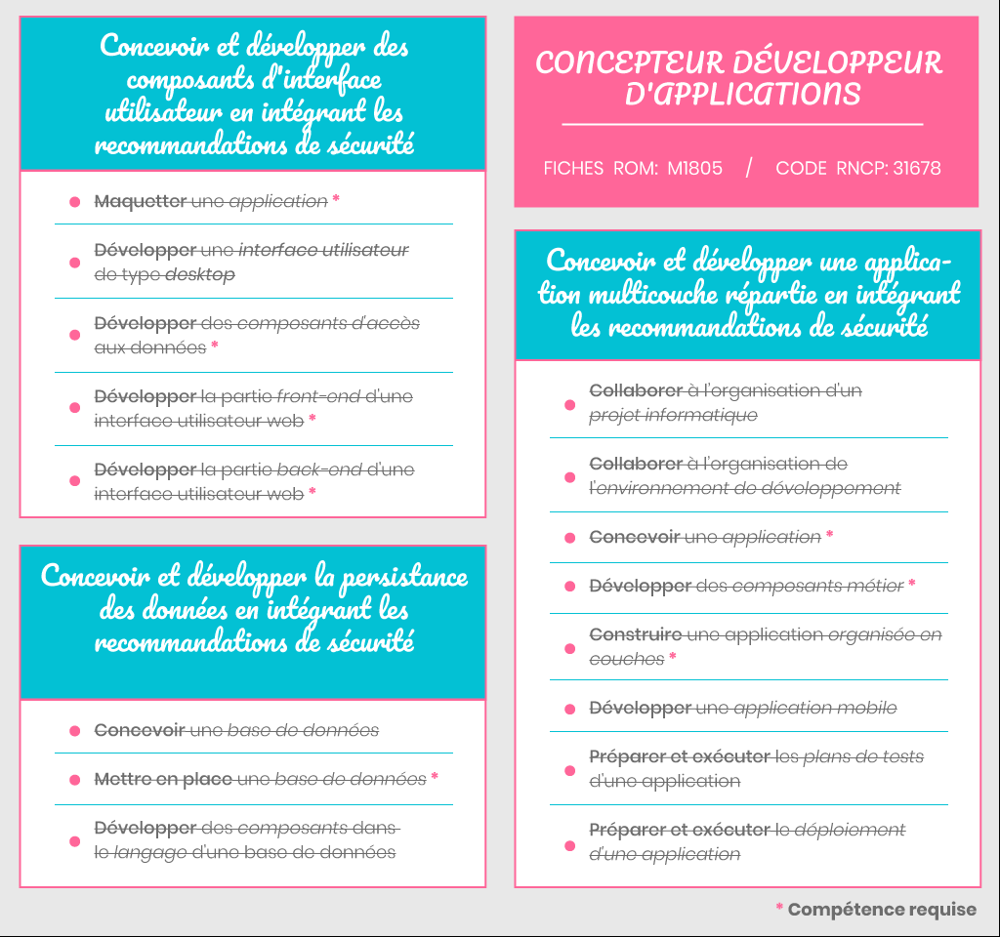

# RNCP requirements 🎓

## 

This project was mainly made to pass the following RNCP title: "Applications designer and developer". The project must contains a server-side application written in Oriented Object language, a SQL database containing all business values of the application, and a front end application to interact properly with the application. *All parts of the application must be created with Security and "Good Practice Patterns" as Golden Rule.*

## Requirements 📖

The following tables represent RNCP Skills **covered in this project** in order to pass the "*Application Designer & Developer*" professional title:

## Skills Details 🔍

> Find below, for each RNCP Skills, related links & code snippet to explain how each part of the application were made.

***

## Contact ✉️

Feel free to [Submit new issue](https://github.com/louiiuol/jar-it/issues) if you have any suggestions or wish to learn more about certain aspects of this project.

🏡 *[Go back home](../README.md)*
