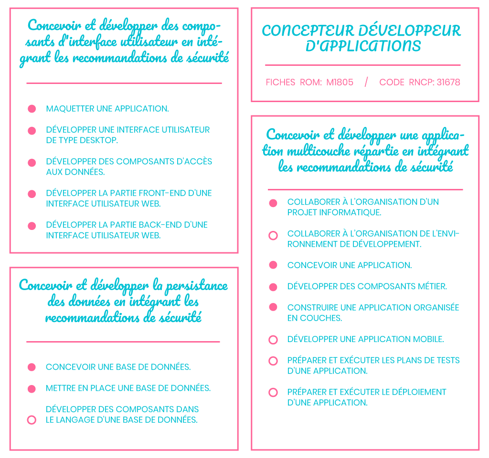

# RNCP requirements

## 

> * This project was mainly made to pass the following RNCP title: "Applications conceptor and developer". The project must contains a server side application written in Oriented Object language, a SQL database containg all buisness values of the application, and a front end application to interact properly with the application.
>
> * *All parts of the application must be created with Security and "Good Practice Patterns" as Golden Rule.*

## Requirements 📖

## Skills Detailed🎓

> Find  all related infos  soon  ..

***

## Contact ✉️

Feel free to [Submit new issue](https://github.com/louiiuol/swear-tin/issues) if you have any suggestions or wish to learn more about certain aspect of this project.

🏡 *[Go back home](https://louiiuol.github.io/swear-tin/)*
