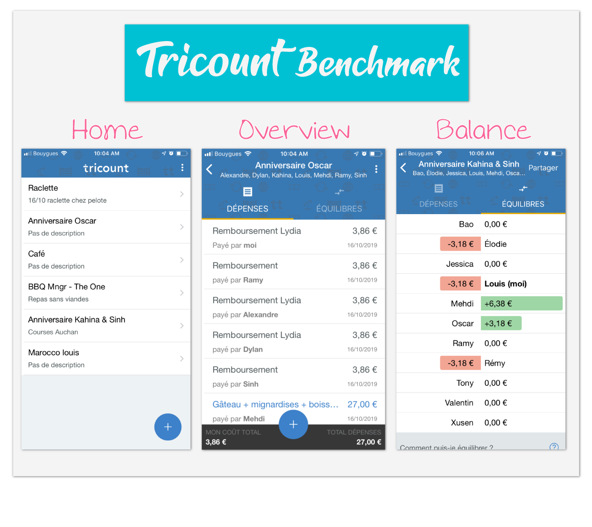

# Benchmark 🔍

## 

This benchmark will be focused on the mobile application of Tricount.
 It helps determine if the development of Cod'Octopus is relevant regarding existing tools like [Tricount](https://www.tricount.com/), by analyzing the following points:

* UI & UX Design
* Content
* Performances
* Features

## Tricount 💰

The closest existing project online would be *Tricount*, which is the solution for organizing group expenses on the web, iPhone and Android. Perfect for trips, holidays, meals or sharing flat expenses with roommates!

### 

## The UI 🖥

Very simplistic graphics and fonts to match everyone's taste. There is, however, no way to customize the display depending on the user logged in.

> **e.Tin will also choose a very soft and clean visual, but could allow users to customize their display regarding their tastes.**

## The UX 🎛

Simplified navigation to the extreme: Only 2 or 3 main views are available. From there, the user can do, in different dropdown and modal, every action they need. So, the website is super easy to use and there is no way to get lost in it.
There is no Guided Tour, to explain to the user, all the actions possible they can do. The app provides, nonetheless, an introduction to explain the use case of this app.

> **e.Tin need to be as simple to use as Tricount, but it will also provide a Guided Tour to help users navigate on the app.**

## Content 📄

The app is available in many languages. Headers are clear and define well the different sections. This improves a lot the readability of the app.
On the other hand, the tone is very cold and serious. It provides a serious image, but a warmer mood would be appreciated.

> **e.Tin will take a similar approach, keeping very simplistic terms so information's meaning is simply understandable. But ChangIt will also bring some humour, to motivate users to keep using the app.**

## Performance 📈

Because the application is downlable on user's mobile, the loading time is relatively short. The app is PWA: no unused packages is loaded. User are authenticated are credentials are stored on mobile device, which also improve loading time.

> **e.Tin should follow the same PWA approach, by loading only used modules, and storing credentials in user device, even though the first approach of the app will be a Website**

## Main Features 🕹

Here are the main features provided by the app:

* Add your fees (with name, author, price and for who)
* Stay sync with everyone balances
* Pay back

Trciount also provides some external features such as help section, and integration with Lydia, and recently IBAN.

> **e.Tin will provides more or less the same features, but used in a specific situation: the funding of an association**

## Conclusion 💡

To conclude ...

## 

***

## Contact ✉️

Feel free to [Submit new issue](https://github.com/louiiuol/swear-tin/issues) if you have any suggestions or wish to learn more about certain aspect of this project.

🏡 *[Go back home](../README.md)*
